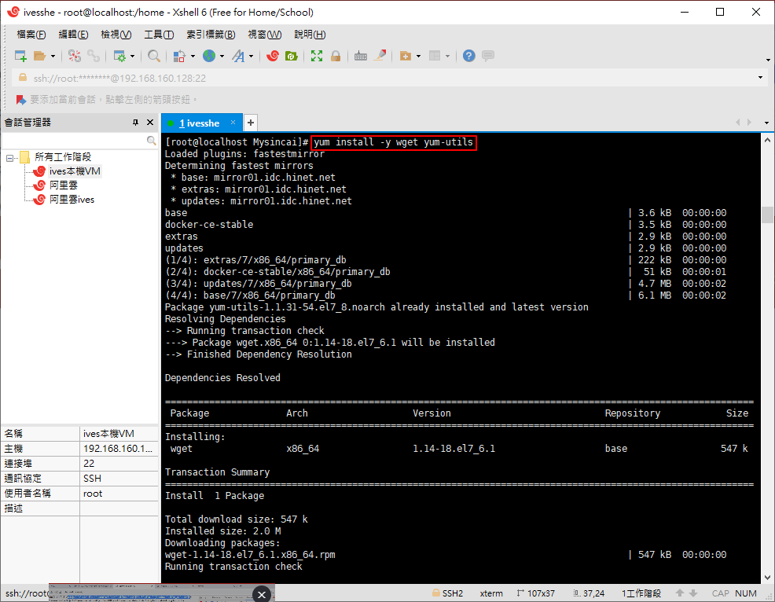
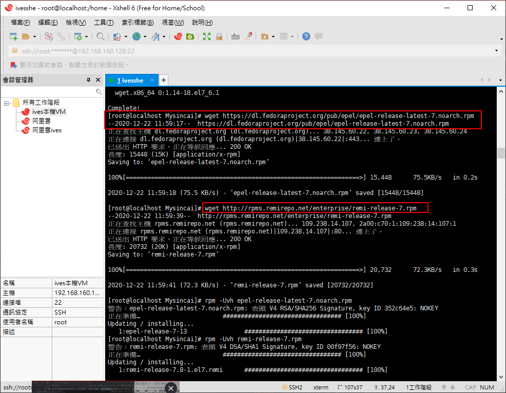
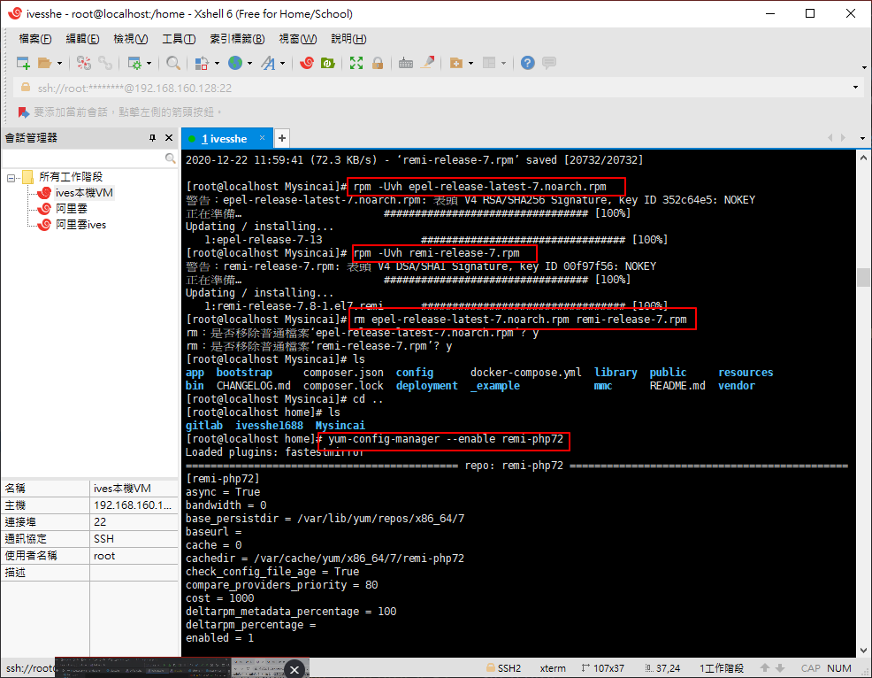
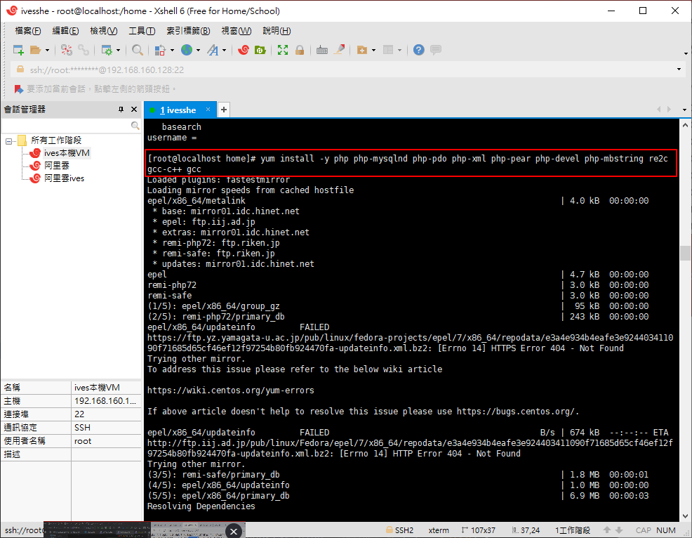
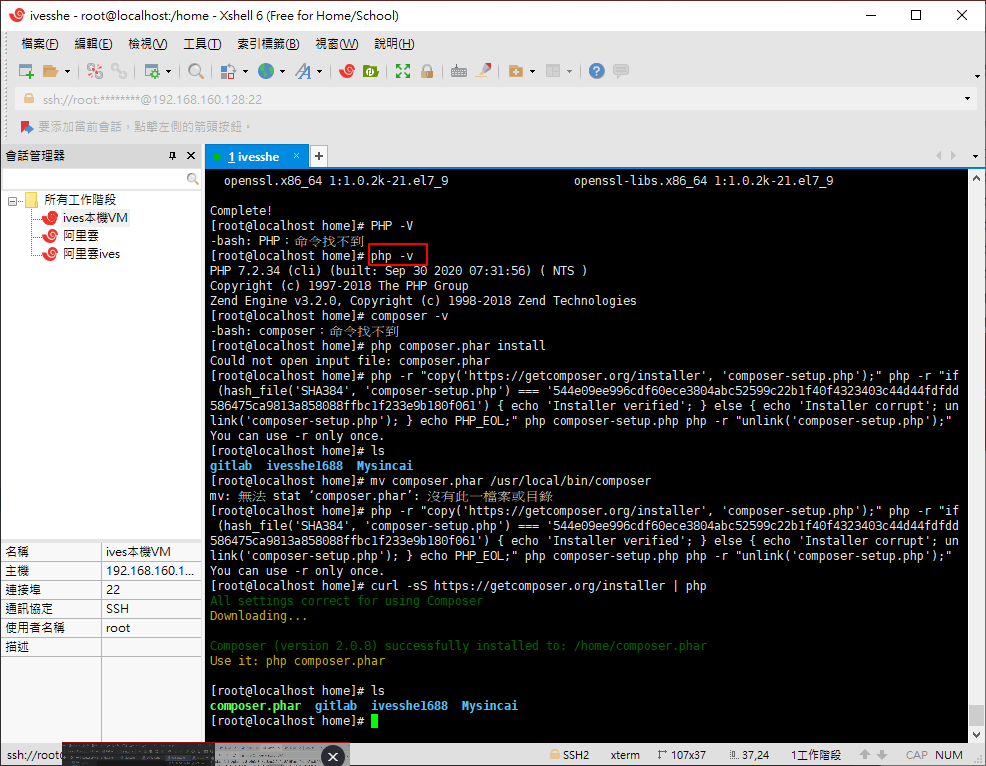

# PHP Linux Study

練習並記錄PHP在Linux的環境下安裝並運行，也方便以要用運用時可以快速查找之前的經驗值

# 安裝PHP

## 安裝所須軟體
```bash
yum install -y wget yum-utils
```



## 較新版的 PHP7 並末收錄在CentOS7，需先更新軟體來源

```bash
wget https://dl.fedoraproject.org/pub/epel/epel-release-latest-7.noarch.rpm

wget http://rpms.remirepo.net/enterprise/remi-release-7.rpm
```


```bash

rpm -Uvh epel-release-latest-7.noarch.rpm
rpm -Uvh remi-release-7.rpm

# 移除下載的檔案
rm epel-release-latest-7.noarch.rpm remi-release-7.rpm

# 指定 PHP 安裝版本
yum-config-manager --enable remi-php72
```



```bash
# PHP 7：remi-php70。
# PHP 7.1：remi-php71。
# PHP 7.2：remi-php72。
```

## 安裝 PHP 與相關軟體
```bash
yum install -y php php-mysqlnd php-pdo php-xml php-pear php-devel php-mbstring re2c gcc-c++ gcc
```


## 檢查 PHP 版本

```bash
php -v
```


# 參考文檔

## PHP
https://www.footmark.info/linux/centos/centos7-install-php7x/


## Composer
https://www.footmark.info/programming-language/php/centos-install-composer/