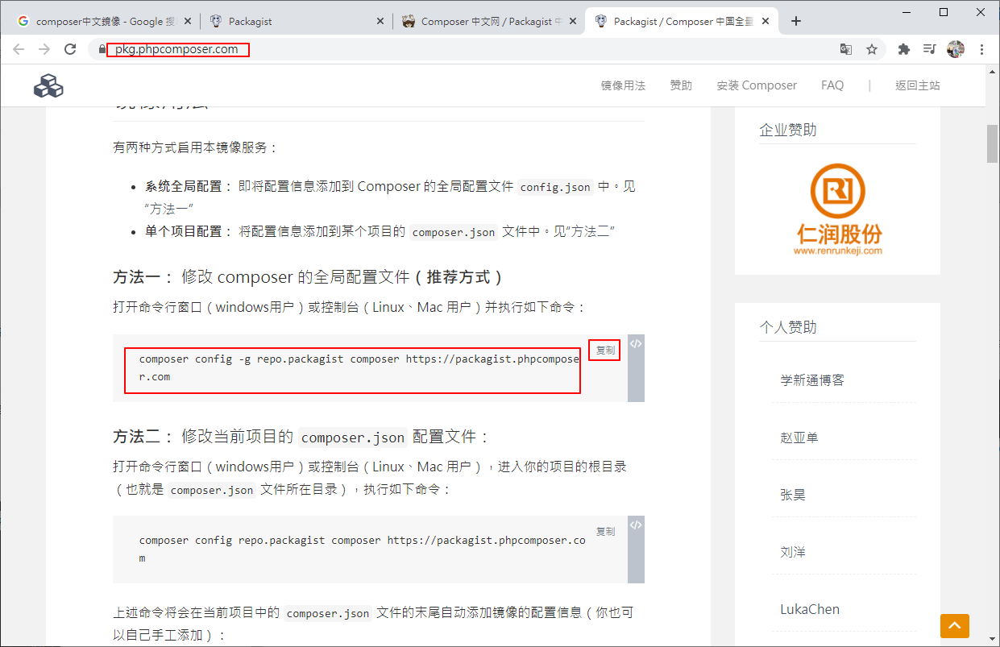
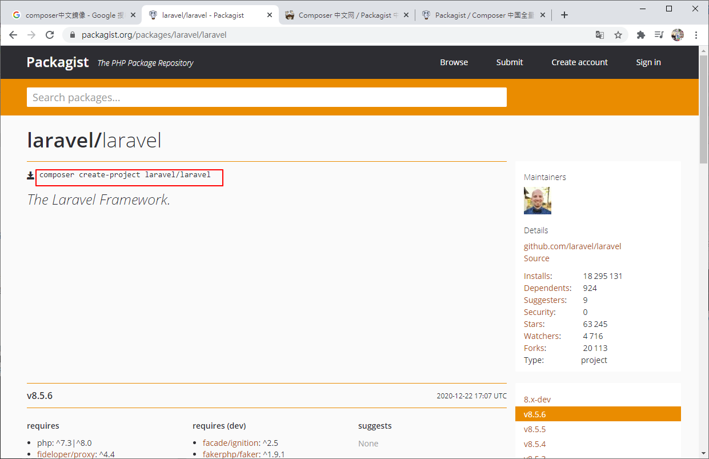

# PHP Composer Linux

練習並記錄PHP在Linux的環境下安裝並運行，也方便以要用運用時可以快速查找之前的經驗值

# 安裝PHP

這邊是使用yum安裝，若要自己configure、make及make install的話，請參考這篇

https://github.com/IvesShe/PHP_FPM_Nginx_MySQL_Redis

## 安裝所須軟體
```bash
yum install -y wget yum-utils
```


## 較新版的 PHP7 並末收錄在CentOS7，需先更新軟體來源

```bash
wget https://dl.fedoraproject.org/pub/epel/epel-release-latest-7.noarch.rpm

wget http://rpms.remirepo.net/enterprise/remi-release-7.rpm
```


```bash

rpm -Uvh epel-release-latest-7.noarch.rpm
rpm -Uvh remi-release-7.rpm

# 移除下載的檔案
rm epel-release-latest-7.noarch.rpm remi-release-7.rpm

# 指定 PHP 安裝版本
yum-config-manager --enable remi-php72
```


```bash
# PHP 7：remi-php70。
# PHP 7.1：remi-php71。
# PHP 7.2：remi-php72。
```

## 安裝 PHP 與相關軟體
```bash
yum install -y php php-mysqlnd php-pdo php-xml php-pear php-devel php-mbstring re2c gcc-c++ gcc
```


## 檢查 PHP 版本

```bash
php -v
```


# 下載並安裝composer

```bash
curl -sS https://getcomposer.org/installer | php
```


# 設定composer

將下載的 composer.phar 移至環境下，並更名為 composer，即可執行指令 composer
```bash
mv composer.phar /usr/local/bin/composer
```


# 查看composer版本

```bash
composer -V
```


發現composer版本似乎太新

經google找到舊版本 1.5.2

https://github.com/composer/composer/releases/tag/1.5.2


# 安裝可能碰到的問題

## 檔案權限不足

-bash: /usr/local/bin/composer: Permission denied

修改composer檔案權限
```bash
chmod 755 composer
```

or

```bash
chmod +x composer
```

## 環境變數沒有關連

/usr/bin/env: php: No such file or directory

增加軟連結
```bash
ln -s /usr/local/webserver/php/bin/php /usr/local/bin/php
```

# Compoer變更鏡像

若覺得原始的鏡像速度太慢，才需要變更

## 查看目前鏡像

```bash
composer config -g -l
```


## 變更目前鏡像

Packagist / Composer 中国全量镜像

https://pkg.phpcomposer.com/

```bash
composer config -g repo.packagist composer https://packagist.phpcomposer.com
```



# Composer相關依賴包

php相關的依賴包都可以在這裡找到，這邊是對應GitHub的資料

之前學習的laravel及其相關的依賴，也是在這邊安裝的

https://packagist.org/





# 參考文檔

## PHP
https://www.footmark.info/linux/centos/centos7-install-php7x/


## Composer
https://www.footmark.info/programming-language/php/centos-install-composer/